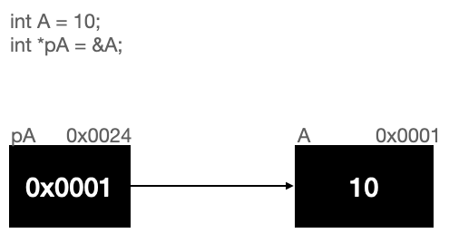

## 자료구조, 더블 포인터

안녕하세요. 둥둥입니다! 오늘은 구조체와 더블 포인터를 주제로 글을 써보려고합니다. 이름부터 난해하죠? 포인터도 어려운데 무려 더블 포인터라니.. 하지만 괜찮아요! 막상 뜯어보면 그냥 포인터의 포인터일뿐이에요..! 

### 포인터의 포인터

지난 몇 강의동안 우리는 포인터에 대해서 배웠어요. 포인터는 뭐라고했죠? 다른 변수의 주소를 담는 변수라고 했습니다. 정확히는 다른 Object의 위치값을 저장하는 변수다. 라고 생각하시면 됩니다. 그렇다면, 포인터의 포인터는 무엇일까요? 동일하게 생각하시면 됩니다! 포인터는 다른 Object의 위치값을 저장하는 변수라고 했습니다. 그렇다면 이 포인터라는 녀석도 결국 변수니까, 다른 변수들처럼 똑같이 저장공간을 가지고 있겠지요?

코드를 하나 보겟습니다.

```
int A = 10;
int *pA = &A;
```

그리고 그림을 하나 볼게요



위 그림은 일반적으로 포인터를 나타낼때의 그림입니다. 포인터 변수 pA에 할당된 영역을 자세히 보시면 0x0024 라는 주소값을 가지고 있는게 보이시나요?

pA의 값은 A의주소 0x0001이며 pA의 주소는 0x0024라는겁니다!

자 그럼 코드를 하나 더 봐볼게요

```
int A = 10;
int *pA = &A;
int **ppA = &pA;
```

그림을 하나 더 볼까요?


어때요! 쉽지않나요? 포인터 변수 pA의 주소를 참조하는 변수 ppA를 만들었습니다. 우리는 이를 흔히들 더블포인터 혹은 이중포인터 라고 부릅니다. 

기억하세요. `포인터도 변수일뿐이다.`

### 더블포인터의 값 출력해보기

위에서 배운 더블 포인터의 값을 실제로 출력해볼거예요. 포인터 변수의 값 출력은 * 기호를 찍어서 했었죠? 다음과 같이 말이에요.

```
int A = 10;
int *pA = &A;

printf("%d", *pA);
```

더블 포인터도 별 다를게 없습니다. 그냥 포인터 변수에 * 을 하나 더 찍는다고 보면 돼요 다음 코드를 직접 실행해보고 어떻게 동작 되는지 한번 확인해보세요!

```
#include <stdio.h>

int main(void){

    int A = 10;
    int *pA = &A;
    int **ppA = &pA;

    printf("A변수의 주소 %p\n", &A);
    printf("pA변수의 값 %p\n", pA);
    printf("pA변수의 주소 %p\n", &pA);

    printf("ppA변수의 값 %p\n", ppA);
    printf("ppA변수의 주소 %p\n", &ppA);

    printf("A변수의 값 방법1 %d\n", A);
    printf("A변수의 값 방법2 %d\n", *pA);
    printf("A변수의 값 방법3 %d\n", **ppA);

    return 0;
}
```


